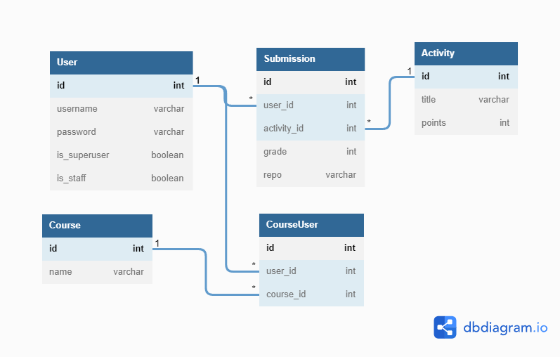

Kanvas
========

Esse projeto simula um sistema de gerenciamento de atividades, submissões e avaliações de alunos.

A plataforma Kanvas possui três tipos de usuários, sendo Estudante, Facilitador e Instrutor.


* * *
Como rodar a aplicação?
--------

1. Crie um arquivo .env na raiz da aplicação seguindo o exemplo contido no arquivo .env.example.
2. Crie um ambiente virtual - `python -m venv venv`
3. Ative o venv - `source venv/bin/activate`
4. Execute as migrações - `python manage.py migrate`
5. Levante o servidor - `python manage.py runserver`


* * *

Diagrama Entidade/Relacionamento
--------------------------------




* * *

Sobre Usuários (`User`):
------------------------

- Estudante -  terá ambos os campos `is_staff` e `is_superuser` com o valor `False`
- Facilitador - terá os campos `is_staff == True` e `is_superuser == False`
- Instrutor - terá ambos os campos `is_staff` e `is_superuser` com o valor `True`


## `POST /api/accounts/` - criando um usuário

```

// REQUEST
{
  "username": "student",
  "password": "1234",
  "is_superuser": false,
  "is_staff": false
}
```

```
// RESPONSE STATUS -> HTTP 201
{
  "id": 1,
  "username": "student",
  "is_superuser": false,
  "is_staff": false
}
```

## `POST /api/login/` - obtendo um token para o usuário

```
// REQUEST
{
  "username": "student",
  "password": "1234"
}
```

```
// REQUEST STATUS -> HTTP 200
{
  "token": "0f500a8c2f2f8d5e77ad86b3a8d373a0528d8812"
}
```

* * *

Sobre Cursos (`Course`)
-------------------


## `POST /api/courses/` - criando um curso
```
// REQUEST
// Header -> Authorization: Token <token-do-instrutor>
{
  "name": "Node"
}
```

```
// RESPONSE STATUS -> HTTP 201
{
  "id": 1,
  "name": "Node",
  "users": []
}
```

## `PUT /api/courses/{course_id}/registrations/` - atualizando a lista de estudantes matriculados em um curso

```
// REQUEST
// Header -> Authorization: Token <token-do-instrutor>
{
  "user_ids": [3, 4, 5]
}
```

```
// RESPONSE STATUS -> HTTP 200
{
  "id": 1,
  "name": "Node",
  "users": [
    {
      "id": 3,
      "username": "student1"
    },
    {
      "id": 4,
      "username": "student2"
    },
    {
      "id": 5,
      "username": "student3"
    }
  ]
}
```

## `GET /api/courses/` - obtendo a lista de cursos e alunos:

```
// RESPONSE STATUS -> HTTP 200
[
  {
    "id": 1,
    "name": "Node",
    "users": [
      {
        "id": 3,
        "username": "student1"
      }
    ]
  },
  {
    "id": 2,
    "name": "Django",
    "users": []
  },
  {
    "id": 3,
    "name": "React",
    "users": []
  }
]
```


## `GET /api/courses/{course_id}/` - filtrando a lista de cursos, fornecendo um course_id opcional

```
// RESPONSE STATUS -> HTTP 200
{
  "id": 1,
  "name": "Node",
  "users": [
    {
      "id": 3,
      "username": "student1"
    }
  ]
}
```

## `DELETE /api/courses/{course_id}/` - deletar cursos

```
// REQUEST
// Header -> Authorization: Token <token-do-instrutor>
```

```
// RESPONSE STATUS -> HTTP 204 NO CONTENT
```

* * *

Sobre Atividades (`Activity`) e Submissões (`Submission`): 
-------------------

## `POST /api/activities/` - criando uma atividade

```
// REQUEST
// Header -> Authorization: Token <token-do-facilitador ou token-do-instrutor>
{
  "title": "Kenzie Pet",
  "points": 10
}
```

```
// RESPONSE STATUS -> HTTP 201
{
  "id": 1,
  "title": "Kenzie Pet",
  "points": 10,
  "submissions": []
}
```

## `GET /api/activities/` - listando atividades

```
// REQUEST
// Header -> Authorization: Token <token-do-instrutor ou token-do-facilitador>        
```

```
// RESPONSE STATUS -> HTTP 200
[
  {
    "id": 1,
    "title": "Kenzie Pet",
    "points": 10,
    "submissions": [
      {
        "id": 1,
        "grade": 10,
        "repo": "http://gitlab.com/kenzie_pet",
        "user_id": 3,
        "activity_id": 1
      }
    ]
  },
  {
    "id": 2,
    "title": "Kanvas",
    "points": 10,
    "submissions": [
      {
        "id": 2,
        "grade": 8,
        "repo": "http://gitlab.com/kanvas",
        "user_id": 4,
        "activity_id": 2
      }
    ]
  },
  {
    "id": 3,
    "title": "KMDb",
    "points": 9,
    "submissions": [
      {
        "id": 3,
        "grade": 4,
        "repo": "http://gitlab.com/kmdb",
        "user_id": 5,
        "activity_id": 3
      }
    ]
  }
]
```

## `POST /api/activities/{activity_id}/submissions/` - fazendo submissão de uma atividade (estudante)

```
// REQUEST
// Header -> Authorization: Token <token-do-estudante>
{
  "grade": 10, // Esse campo é opcional
  "repo": "http://gitlab.com/kenzie_pet"
}
```

```
// RESPONSE STATUS -> HTTP 201
{
  "id": 7,
  "grade": null,
  "repo": "http://gitlab.com/kenzie_pet",
  "user_id": 3,
  "activity_id": 1
}
```

## `PUT /api/submissions/{submission_id}/` - editando a nota de uma submissão (facilitador ou instrutor)

```
// REQUEST
// Header -> Authorization: Token <token-do-facilitador ou token-do-instrutor>
{
  "grade": 10
}
```

```
// RESPONSE STATUS -> HTTP 200
{
  "id": 3,
  "grade": 10,
  "repo": "http://gitlab.com/kenzie_pet",
  "user_id": 3,
  "activity_id": 1
}
```

## `GET /api/submissions/` - listando submissões (apenas usuários autenticados)

```
//REQUEST
//Header -> Authorization: Token <token-do-estudante>
```

```
// RESPONSE STATUS -> HTTP 200
[
  {
    "id": 2,
    "grade": 8,
    "repo": "http://gitlab.com/kanvas",
    "user_id": 4,
    "activity_id": 2
  },
  {
    "id": 5,
    "grade": null,
    "repo": "http://gitlab.com/kmdb2",
    "user_id": 4,
    "activity_id": 1
  }
]
```

* * *

Resumo dos Endpoints:
----------

URLs:
-----

| Método | Endpoint | Responsabilidade |
|--- |--- |--- |
| POST | /api/accounts/ | Criação de usuários |
| POST | /api/login/ | Faz a autenticação do usuário |
| POST | /api/courses/ | cria curso (instrutor) |
| PUT | /api/courses/{course_id}/registrations/ | matricula estudantes em um determinado curso (instrutor) |
| GET | /api/courses/ |  lista cursos e alunos matriculados (sem autenticação) |
| GET | /api/courses/{course_id}/ | filtrando a lista de cursos, fornecendo um course_id opcional (sem autenticação) |
| DELETE | /api/courses/{course_id}/ | exclui cursos do sistema (instrutor) |
| POST | /api/activities/ | cria uma atividade (facilitador ou instrutor) |
| GET | /api/activities/ | lista atividades e submissões (facilitador ou instrutor) |
| POST  | /api/activities/{activity_id}/submissions/ | fazendo submissão de uma atividade (estudante) |
| PUT   | /api/submissions/{submission_id}/ | editando a nota de uma submissão (facilitador ou instrutor) |
| GET   | /api/submissions/ | listando submissões (apenas usuários autenticados) |


* * *
